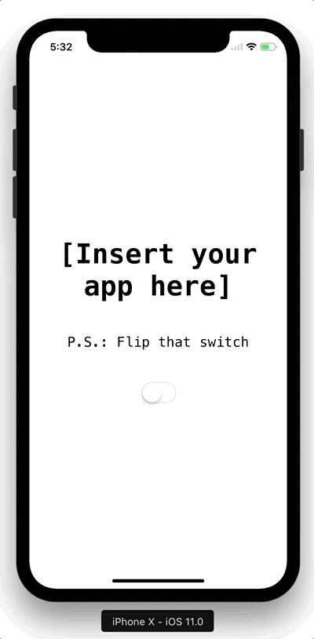

# NotchKit

[](https://travis-ci.org/HarshilShah/NotchKit)
[](https://github.com/HarshilShah/NotchKit/releases/latest)
[](http://cocoapods.org/pods/NotchKit)
[](https://github.com/Carthage/Carthage)
[](https://github.com/HarshilShah/NotchKit/blob/master/LICENSE)
[](https://twitter.com/HarshilShah1910)

NotchKit is a simple way to hide the notch on the iPhone X, and create a card-like interface for your apps. Inspired by [this tweet from Sebastiaan de With](https://twitter.com/sdw/status/903060778340593664):

<blockquote class="twitter-tweet" data-lang="en"><p lang="en" dir="ltr">I hope / wish that the &#39;iPhone 8&#39; UI looks like this: using black OLED or wallpaper behind to make apps &#39;cards&#39;. Would be beautiful. <a href="https://t.co/mravS87NFy">pic.twitter.com/mravS87NFy</a></p>&mdash; Sebastiaan de With (@sdw) <a href="https://twitter.com/sdw/status/903060778340593664">August 31, 2017</a></blockquote>

Here's what it looks like:



## Requirements

- Swift 3
- iOS 8

## Installation

NotchKit is available via CocoaPods and Carthage

### CocoaPods

To install NotchKit using [CocoaPods](http://cocoapods.org), add the following line to your Podfile:

```
pod 'NotchKit'
```

### Carthage

To install NotchKit using [Carthage](https://github.com/Carthage/Carthage), add the following line to your Cartfile:

```
github "HarshilShah/NotchKit"
```

## Usage

Integrating NotchKit is extremely simple. Firstly, import `NotchKit` in the file where your AppDelegate is stored.

Next, replace the `didFinishLaunchingWithOptions` method with the following, swapping in your custom view controller's class in place of `ViewController`

```swift
func application(_ application: UIApplication, didFinishLaunchingWithOptions launchOptions: [UIApplicationLaunchOptionsKey: Any]?) -> Bool {
    window = NotchKitWindow(frame: UIScreen.main.bounds)
    let rootViewController = ViewController()
    window?.rootViewController = rootViewController
    window?.makeKeyAndVisible()
    return true
}
```

If you use Storyboards, you can instantiate your Storyboard and fetch the new `rootViewController` in code using the following, swapping in your Storyboard's class for `Main`:

```swift
let storyboard = UIStoryboard(name: "Main", bundle: nil)
let rootViewController = storyboard.instantiateInitialViewController()
```

If you target a version of iOS earlier than iOS 11, you can still use NotchKit by loading the `NotchKitWindow` conditionally using the `#available` syntax, as follows:

```swift
window = {
    if #available(iOS 11, *) {
        return NotchKitWindow()
    } else {
        return UIWindow()
    }
}()
```

And that's all, you're done!

## Customisation

There are some customisation points offered in NotchKit.

You can adjust these from any view or view controller belonging to the window, by simply calling the window as a `NotchKitWindow`, as follows:

```swift
(view.window as? NotchKitWindow)?.propertyToCustomise = valueYouWantToSet
```

### Target Devices

By default, NotchKit hides the status bar and home indicator on all devices. However if you choose you can limit this behaviour to just the iPhone X and have it do nothing on other devices by setting the `shouldShowBarsOnlyOniPhoneX` property to `true`.

### Masked Edges

By default, NotchKit masks all edges where applicable. You can customise this behaviour using the `maskedEdges` property, which accepts a `UIRectEdge` object that specifies the edges you want to mask.

### Corner Radius

You can customise the corner radius of the window, via the `.cornerRadius` property. This property is an enum and can either be `.standard`, which does all the maths for you to show an appropriate corner radius, or you can set a custom value by setting it to `.custom(n)`, where `n` is a custom corner radius of your choice.

## Author

Written by Harshil Shah. You can [find me on Twitter](https://twitter.com/HarshilShah1910).

## License

NotchKit is available under the MIT license. See the LICENSE file for more info.

----

P.S.: This was made mostly as a joke while I was debating different ways to handle the iPhone X.

Apple's updated [Human Interface Guidelines for the iPhone X](https://developer.apple.com/ios/human-interface-guidelines/overview/iphone-x) explicitly call this out:

> **Don't mask or call special attention to key display features.** Don't attempt to hide the device's rounded corners, sensor housing, or indicator for accessing the Home screen by placing black bars at the top and bottom of the screen. Don't use visual adornments like brackets, bezels, shapes, or instructional text to call special attention to these areas either.

I'm not sure if violating the HIG is often used as grounds for a rejection, however I wouldn't bet either way.

It only took me a couple of days using the simulator to realise that embracing the notch is the way forward. My intention with open-sourcing this was to make it easier for others to reach that conclusion as well.

#EmbraceTheNotch
